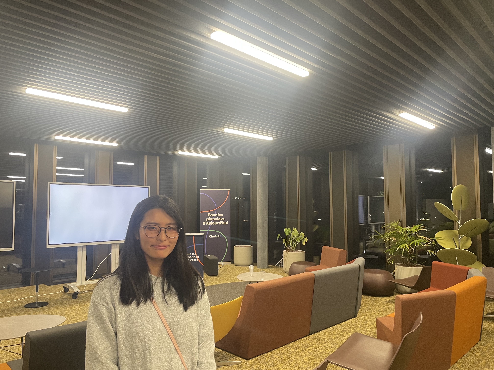

# 👋 Hi, I'm Misuzu!
## Events & Learning

### 2026-04-30 — PyData / Python Event (Sion)

- Attended technical talks about Artificial Intelligence and JAX
- Learned about high-performance numerical computing with JAX
- Networked with local developers

Key takeaway:
- Python ecosystem is evolving quickly around AI and performance tools

Photo:

## About Me

🌍 Based in Valais, Switzerland  
🇯🇵 Japanese developer learning and building in Europe  
💻 Passionate about Python and building real-world projects  
🎯 Goal: Become a professional developer through continuous learning and real-world projects  

📢 Sharing my coding journey on GitHub & X  
🔗 X (Twitter): https://x.com/code_with_zita

---

## Currently Learning

- Python (real-world applications & advanced topics)  
- AI & modern Python tools (e.g., JAX)  
- Web development (Flask / Streamlit / JavaScript basics)  
- Data handling, APIs, and automation  

---

## Featured Projects

📍 Switzerland Kids-Friendly Places — Family-friendly location app  
💬 Chat App — Real-time communication experiment  
🗂️ Personal Tools — Small utilities for daily life and automation  

---

## Tech Stack

## Languages

